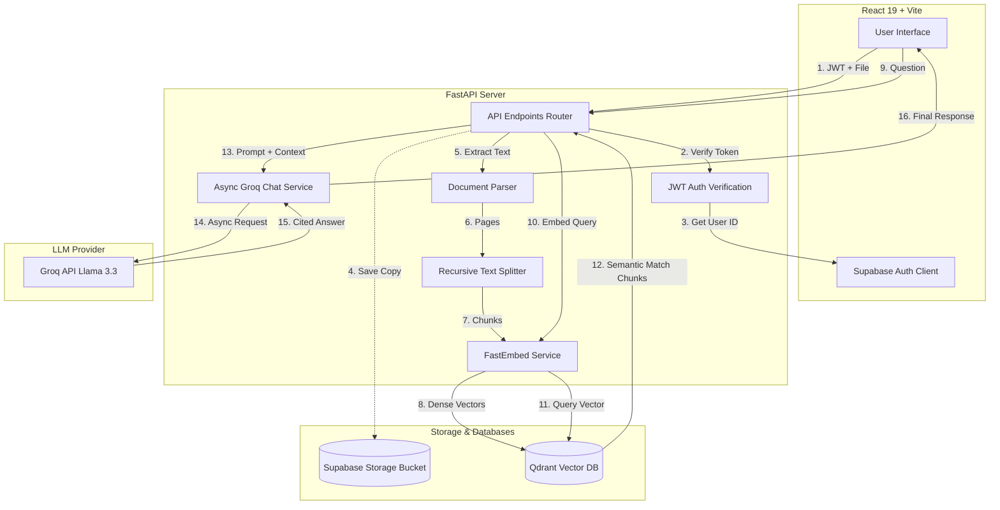

# DocPilot AI ✈️

**DocPilot AI** is a production-ready, full-stack Retrieval-Augmented Generation (RAG) document intelligence platform. It allows users to authenticate securely, upload various document formats (PDF, DOCX, PPTX, CSV, TXT), and ask natural-language questions to receive accurate, context-constrained responses with verified inline citations.

---

## 🏗️ System Architecture

The following diagram illustrates the end-to-end data flow for both **Document Ingestion** and **RAG Query Retrieval**:



---

## 🛠️ Technology Stack

* **Frontend**: React 19, Vite, Lucide Icons, Vanilla CSS (Glassmorphism layout + animated floating background orbs).
* **Backend**: FastAPI, Python 3.12, Uvicorn (ASGI server).
* **Vector Database**: Qdrant (supports both local disk storage for development and cloud clusters for production).
* **Embeddings Generation**: FastEmbed (`BAAI/bge-small-en-v1.5`), executing fully local text-to-vector compilation.
* **LLM Provider**: Groq API (`llama-3.3-70b-versatile` running via asynchronous HTTP completions).
* **Object Storage & Auth**: Supabase Auth (JWT validation) & Supabase Storage (document persistence).

---

## ⚡ How It Works (Step-by-Step)

### 1. Secure Authentication Flow

* The frontend uses the `@supabase/supabase-js` SDK to handle registration and logins.
* Upon successful authentication, the frontend receives a Supabase JWT (JSON Web Token).
* All backend API calls pass this JWT in the `Authorization: Bearer <JWT>` HTTP header.
* The backend validates the token using Supabase's user verification endpoint to retrieve a secure, isolated `user_id`.

### 2. Document Ingestion Pipeline

When a user drops a file into the sidebar dropzone:

1. **Authorization check**: The token is verified, extracting the client's `user_id`.
2. **Cloud Storage (Supabase)**: The file is uploaded to the user's isolated folder (`{user_id}/{filename}`) in the Supabase `documents` bucket. If keys are missing, it falls back gracefully to local-only parsing.
3. **Local Buffering**: The file content is temporarily buffered to the local `uploads/` folder.
4. **Parsing**: The `DocumentParser` inspects the extension:
    * `PDF`: Extracted page-by-page using `PyMuPDF (fitz)`.
    * `DOCX`: Parsed using `python-docx`.
    * `PPTX`: Extracted slide-by-slide using `python-pptx`.
    * `CSV`: Read using `pandas` and compiled to column-value row strings.
    * `TXT`: Read directly with utf-8 encoding.
5. **Chunking**: Chunks are split using `RecursiveCharacterTextSplitter` with a `chunk_size` of 500 characters and a `chunk_overlap` of 50 characters to preserve section context.
6. **Embedding**: Text chunks are embedded locally using the `BAAI/bge-small-en-v1.5` model, producing 384-dimensional vector arrays.
7. **Indexing**: Vectors are upserted into Qdrant containing metadata payloads (`text`, `page_number`, `source`, and `user_id`).

### 3. Retrieval-Augmented Generation (RAG) Query Pipeline

When a user asks a question in the chat bar:

1. **Query Embedding**: The question is embedded locally via FastEmbed to produce a matching 384-dimensional query vector.
2. **Vector Match (Qdrant)**: Qdrant performs a Cosine Distance similarity search using the query vector.
    * *Security Isolation*: A metadata filter (`must=[models.FieldCondition(key="user_id", match=models.MatchValue(value=user_id))]`) is applied to ensure users can search **only** their own uploaded documents.
3. **Context Assembly**: The top 5 matching text chunks are formatted as a structured context block containing the filename and page number.
4. **Async Groq Chat Completion**:
    * The prompt is split into a **System Role** (instructing the AI to act as DocPilot, use *only* the context, cite source files, and avoid hallucinations) and a **User Role** containing the document context and question.
    * The request is dispatched asynchronously via `AsyncGroq` client to avoid blocking the event loop.
    * A `tenacity` wrapper manages transient errors, retrying up to 3 times with exponential backoff on HTTP 429 (rate-limited) or connection failures.
5. **Response Generation**: The cited response is sent back to the frontend and rendered in the conversation window.

---

## ⚙️ Environment Variables (`.env`)

Create a `.env` file in the root directory. Copy `.env.example` and populate it:

```env
# ── Gemini (Optional Fallback) ──────────────────────
GEMINI_API_KEY=your_gemini_api_key_here

# ── Groq API (Primary LLM Engine) ──────────────────
GROQ_API_KEY=gsk_your_groq_api_key_here
GROQ_MODEL=llama-3.3-70b-versatile

# ── Supabase Credentials ───────────────────────────
SUPABASE_URL=https://your-project-id.supabase.co
SUPABASE_ANON_KEY=your_supabase_anon_client_key
SUPABASE_SERVICE_ROLE_KEY=your_supabase_service_role_key

# ── Qdrant Configuration ───────────────────────────
# Leave URL empty to use local file storage (qdrant_db/)
QDRANT_URL=
QDRANT_API_KEY=
QDRANT_COLLECTION=docpilot_docs

# ── Frontend Configuration ─────────────────────────
VITE_SUPABASE_URL=https://your-project-id.supabase.co
VITE_SUPABASE_ANON_KEY=your_supabase_anon_client_key
VITE_API_BASE_URL=http://localhost:8000/api

# ── App Settings ───────────────────────────────────
UPLOAD_DIR=uploads
```

---

## 🚀 Running the Project from Scratch

### Prerequisites

* Python 3.10+
* Node.js 18+ & npm

### Step 1: Set up the Backend

1. Navigate to the project root:

    ```bash
    cd "c:\Users\omkar\Desktop\DocPilot AI"
    ```

2. Install Python dependencies:

    ```bash
    pip install -r backend/requirements.txt
    ```

3. Launch the FastAPI backend server:

    ```bash
    python -m uvicorn backend.app.main:app --host 127.0.0.1 --port 8000
    ```

### Step 2: Set up the Frontend

1. Open a new terminal window and navigate to the frontend directory:

    ```bash
    cd "c:\Users\omkar\Desktop\DocPilot AI\frontend"
    ```

2. Install package dependencies:

    ```bash
    npm install
    ```

3. Launch the Vite development server:

    ```bash
    npm run dev
    ```

4. Open [http://localhost:3000](http://localhost:3000) in your browser.

---

## 📈 Production Readiness Checklist

If you plan on deploying this project to staging or production, implement the following roadmap items:

* [ ] **Validate Supabase JWT Signature**: Replace the truncated placeholder service-role key in `.env` with a signed keyset.
* [ ] **Switch to Async Processing**: Large documents currently chunk/embed synchronously. Introduce a background worker queue (Celery + Redis) to handle uploads asynchronously.
* [ ] **Enable Client-side Upload Progress**: Upgrade from fetch to Axios to track upload percentage bars in the UI.
* [ ] **Stream Chat completions**: Implement Server-Sent Events (SSE) to stream Llama-3's answers chunk-by-chunk to the user.
* [ ] **Secure output rendering**: Clean and sanitize Markdown generated by Groq (using `DOMPurify` + `react-markdown`) to prevent XSS.
